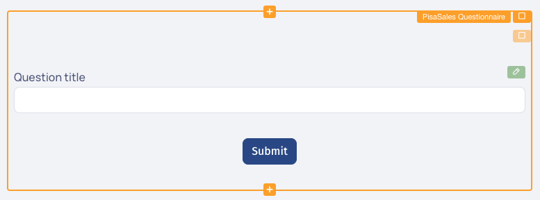
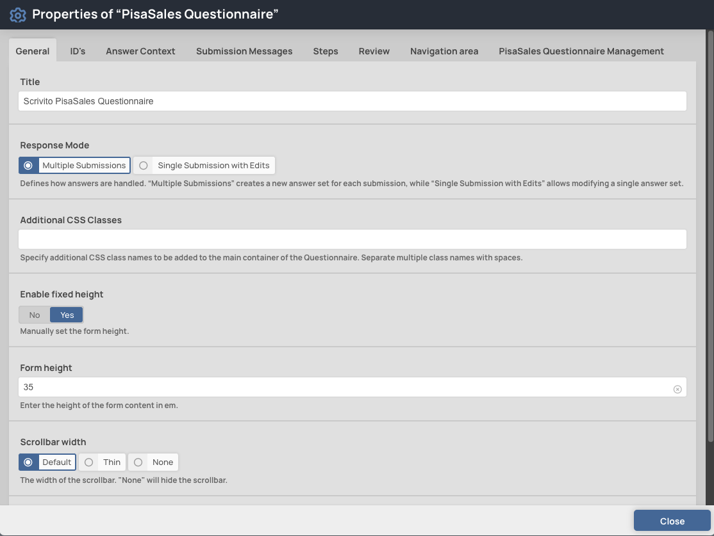
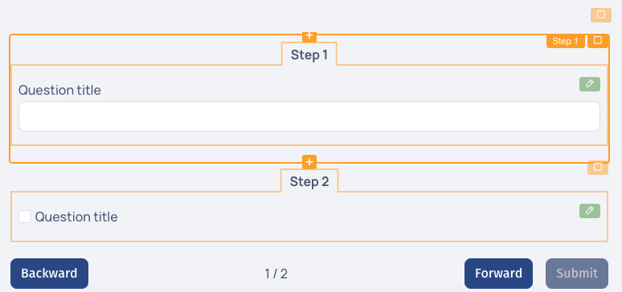
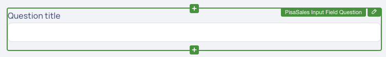
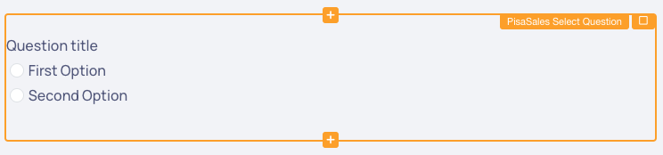
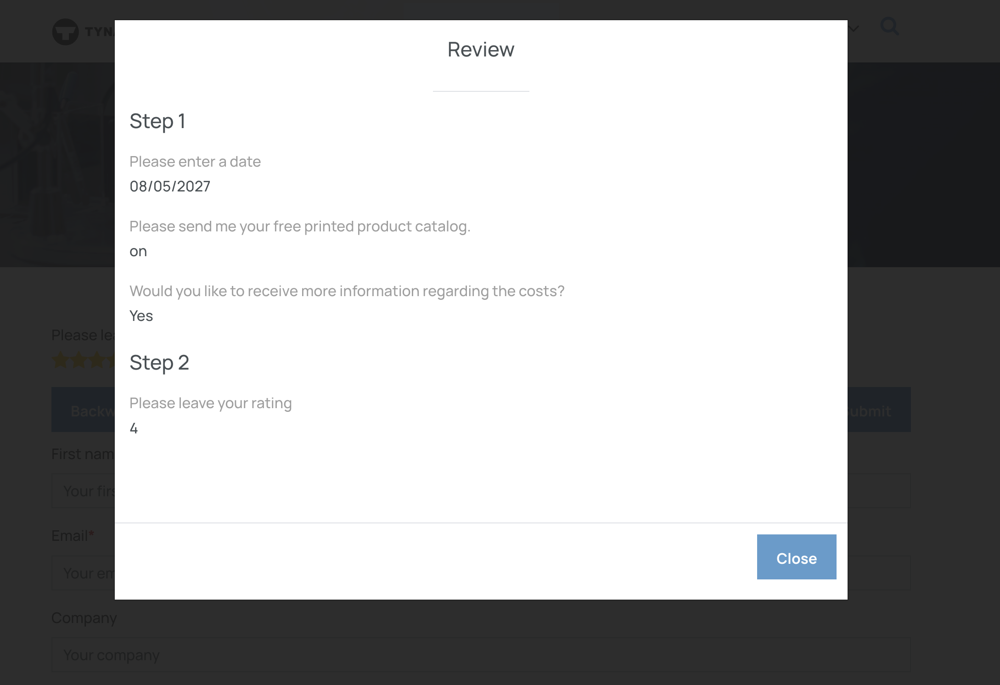
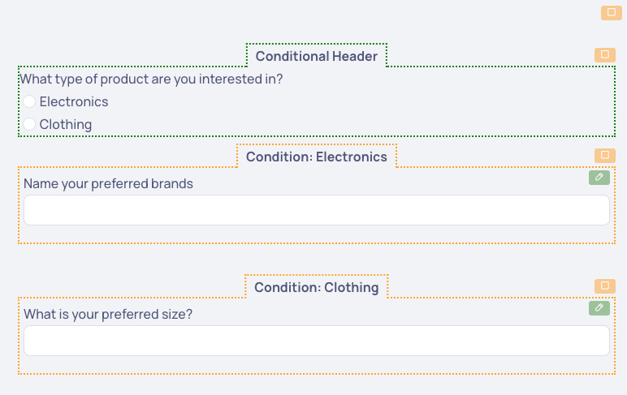

# psa-scr-qst-tst (Proof of Concept)

## 🚧 Proof of Concept (PoC): This package is currently in PoC mode. Use at your own risk, as changes and improvements are ongoing. It is not yet ready for production environments.

## Table of Contents
1. [Overview](#overview)
2. [Features](#features)
3. [Installation](#installation)
4. [Importing and Initializing](#importing-and-initializing)
5. [Default Templates & Availability](#default-templates--availability)
6. [Supported Questionnaire Input Types (Response Mode)](#supported-questionnaire-input-types-response-mode)
7. [Questionnaire Widgets](#questionnaire-widgets)
    - [PisaSales Questionnaire Widget](#pisasales-questionnaire-widget)
    - [PisaSales Questionnaire Step Widget](#pisasales-questionnaire-step-widget)
    - [PisaSales Questionnaire Input Question Widget](#pisasales-questionnaire-input-question-widget)
    - [PisaSales Questionnaire Checkbox Question Widget](#pisasales-questionnaire-checkbox-question-widget)
    - [PisaSales Questionnaire Select Question Widget](#pisasales-questionnaire-select-question-widget)
    - [PisaSales Questionnaire Answer Option Widget](#pisasales-questionnaire-answer-option-widget)
8. [Creating & Updating a Questionnaire](#questionnaire-creation-and-updating)
9. [Using Questionnaires Across Pages](#questionnaire-usage-across-different-pages)
10. [Review Feature](#review-feature)
11. [Conditionals in PisaSales Questionnaires](#conditionals-in-pisasales-questionnaires)
12. [Local Development](#local-development)

---

## Overview
This package provides a collection of widgets for creating and using PisaSales questionnaires within the Scrivito CMS. These questionnaires cannot be used on public sites.

## Features
- **Questionnaire Creation**: Build questionnaires directly from the Scrivito CMS editor.
- **Questionnaire Usage**: Use created questionnaires within restricted sites only.
- **Answer Submission & Retrieval**: Submit and retrieve answers using context parameters such as questionnaireId, projectId, activityId, and contactId.

## Installation

Install the package into your scrivito portal app:

```shell
npm install psa-scr-qst-tst
```

### Importing and Initializing

Import the `initPisaQuestionnaireWidgets` function from the package and call it in your index.ts file found in the Widgets folder (e.g., in `src/Widgets/index.ts`). Make sure to provide the URL to your PisaSales REST API as the pisaUrl parameter:

```js
import { initPisaQuestionnaireWidgets } from "psa-scr-qst-tst";

// Replace "YOUR_PISA_API_URL" with the actual PisaSales REST API URL
initPisaQuestionnaireWidgets({ pisaUrl: "YOUR_PISA_API_URL" });

```

Import the `loadQuestionnaireEditingConfigs` function from the package and call it in your editingConfigs.ts file also found in the Widgets folder.

```js
import { loadQuestionnaireEditingConfigs } from "psa-scr-qst-tst/editing";

loadQuestionnaireEditingConfigs();
```

Add the widget styles to your app.
This can be done by either loading the CSS via `css-loader` (e.g. in `src/index.js` or `src/Widgets/index.js`):

```js
import "psa-scr-qst-tst/index.css";
```

Or by importing the styles into your stylesheets (e.g. in `src/assets/stylesheets/index.scss`):

```scss
@import "psa-scr-qst-tst/index.css";
```

Add the editing styles in `scrivitoExtensions.scss`:

```scss
@import "psa-scr-qst-tst/editing.css";
```


## Default Templates & Availability 
| Widget Category | Equivalent Templates | Type/Functionality  | Notes  |
|-----------------------|----------------------------|------------------------------------|--------------------------|
| **Input Widget**    | PSA_QST_TPL_QUE_STR | Single-line text input|✅ Implemented           |
|                     | PSA_QST_TPL_STR_MUL |Multi-line text input  |❌ Not Needed           |
|                     | PSA_QST_TPL_CLB   | Multi-line text input | ✅ Implemented            |
|                     | PSA_QST_TPL_BLB  | Multi-line text input  | ❌ Not Needed                  |
|                     | PSA_QST_TPL_INT  | Integer (numeric number input)| ✅ Implemented         |
|                     | PSA_QST_TPL_FLO  | Float (decimal number input)| ✅ Implemented          |
|                     | PSA_QST_TPL_DAT_TIM  | Date and time input| ✅ Implemented                |
|                     | PSA_QST_TPL_DAT  |Date-only input| ✅ Implemented                |
|                     | PSA_QST_TPL_MON   | Money input field      | ❌ Not Planned     |
| **Select Widget** | PSA_QST_TPL_CHC  | Regular dropdown   |✅ Implemented             |
|                     | PSA_QST_TPL_CTY   | Countries dropdown   |❌ Rejected (requires API) |
|                     | PSA_QST_TPL_LNG   | Language dropdown    |❌ Rejected (requires API) |
|                     | PSA_QST_TPL_LOB   | Business dropdown         |❌ Rejected (requires API) |
|                     | PSA_QST_TPL_RAD     | Single-select radios    | ✅ Implemented            |
|                     | PSA_QST_TPL_CHK     | Multi-select checkboxes    | ✅ Implemented       |
|**Checkbox Widget**  | PSA_QST_TPL_LOG_NUL  | Tri-state single-select checkbox  | ✅ Implemented  |
|                     | PSA_QST_TPL_LOG      | Single-select checkbox  | ✅ Implemented          |
| **File Widget**     | PSA_QST_TPL_FIL     | Single file upload        |⏳ Pending Decision      |
|                     | PSA_QST_TPL_FIL_MUL  | Multi-file upload      |⏳ Pending Decision        |
| **Signature Widget**| PSA_QST_TPL_SIG     | Signature              |⏳ Pending Decision       |
| **Miscellaneous**   | PSA_QST_TPL_URL     | URL for redirection       |❌ Not Needed           |
|                     | PSA_QST_TPL_SLD     | Numeric slider (0-10)      |⏳ Pending Decision    |
|                     | PSA_QST_TPL_ORG_PIC | Image display            |❌ Not Needed            |
|                     | PSA_QST_TPL_HEA     | Heading                 |❌ Not Needed             |

## Supported Questionnaire Input Types (Response Mode)

The `psa-scr-qst-tst` package supports multiple questionnaire input types, determining how answers are retrieved, submitted, and managed during usage. These modes are defined as follows:

### **Multiple Submissions (`PSA_QST_INP_TYP_REP`)**
- **Behavior**: A new set of answers is created every time the questionnaire is filled. Existing answers are not retrieved or edited.

### **Single Submission with Edits (`PSA_QST_INP_TYP_ONC_UPD`)**
- **Behavior**: A single instance of the questionnaire is associated with the context. The user can view and modify their previous answers.

### **Once Only (`PSA_QST_INP_TYP_ONC`)** *(Not supported)*
- **Behavior**: A single instance of the questionnaire is associated with the context. Once the questionnaire is submitted, it cannot be edited or resubmitted.


## Questionnaire Widgets

### PisaSales Questionnaire Widget

 

The `Questionnaire` widget is the main widget for creating and managing questionnaires. 

#### Properties

 

The `Questionnaire` widget has the following properties divided into several tabs:

- **General** tab
  - **Title:** Enter the title for the questionnaire.
  - **Response Mode:** Select the [response mode](#supported-questionnaire-input-types-response-mode) for the questionnaire.
  - **Additional CSS Classes:** Specify additional CSS class names to be added to the main container of the questionnaire. Separate multiple class names with spaces.
  - **Enable fixed height:** Manually set the form height if enabled.
  - **Form height:** Enter the height of the questionnaire content measured in em units.
  - **Scrollbar width:** Select the width of the scrollbar. "None" will hide the scrollbar.
  - **Overscroll behavior:** Select how overscrolling should behave, i.e. it scrolls also the container."
- **ID's** tab
  - **External ID:** The external reference ID for the questionnaire.
  - **Questionnaire ID (GID):** The questionnaire ID in PisaSales.(Visible after questionnaire got created)
- **Answer Context** tab
  - **Activity ID Source:** Select whether to manually enter the Activity ID or retrieve it from a DataItem attribute.
  - **Activity ID:** Manully enter the Activity ID. (Visible if selected source is "manual")
  - **Name of the data attribute in question:** Enter the name of the data attribute to read the activity id from.(Visible if selected source is "DataItem")
  - **Activity ID data attribute value:** The value behind the data item attribute name.(Visible if selected source is "DataItem")
  - **Contact ID Source:** Select whether to manually enter the Contact ID or retrieve it from a DataItem attribute.
  - **Contact ID:** Manully enter the Contact ID. (Visible if selected source is "manual")
  - **Name of the data attribute in question:** Enter the name of the data attribute to read the contact id from.(Visible if selected source is "DataItem")
  - **Contact ID data attribute value:** The value behind the data item attribute name.(Visible if selected source is "DataItem")
  - **Project ID Source:** Select whether to manually enter the Project ID or retrieve it from a DataItem attribute.
  - **Project ID:** Manully enter the Project ID. (Visible if selected source is "manual")
  - **Name of the data attribute in question:** Enter the name of the data attribute to read the project id from.(Visible if selected source is "DataItem")
  - **Project ID data attribute value:** The value behind the data item attribute name.(Visible if selected source is "DataItem")
- **Submission messages** tab
  - **Submitting message type:** Select the type of message displayed while the questionnaire answers are being submitted.
  - **Submitting message:** Message shown while the questionnaire answers are being submitted. (Visible if submitting message type is set to `Default text`).
  - **Submitting content:** Widgets shown while the questionnaire answers are being submitted. (Visible if submitting message type is set to `Custom content`).
  - **Preview submitting message/widgets:** Preview the message or content displayed while the questionnaire answers are being submitted. Works only in edit mode.
  - **Submission success message type:** Select the type of message displayed after successful answer submission.
  - **Submitted message:** Message shown after the answers are successfully submitted. (Visible if submission success message type is set to `Default text`).
  - **Submission success content:** Widgets shown after the answers are successfully submitted. (Visible if submission success message type is set to `Custom content`).
  - **Preview success message/widgets:** Preview the message or content displayed after the answers are successfully submitted. Works only in edit mode.
  - **Submission failure message type:** Select the type of failure message displayed upon submission failure.
  - **Failed message:** Message shown if the answer submission failed. (Visible if submission failure message type is set to `Default text`).
  - **Submission failure content:** Widgets shown if the answer submission failed. (Visible if submission failure message type is set to `Custom content`).
  - **Show retry button:** Show a retry button at the end of the message/widgets.
  - **Retry button text:** The text for the retry button.
  - **Retry button alignment:** Alignment for the retry button.
  - **Preview failed message/widgets:** Preview the message or content displayed if the answer submission failed. Works only in edit mode.
- **Steps** tab
  - **Steps:** Configure the questionnaire steps.
- **Review** tab
  - **Enable Review:** Adds a button to the last step of "Multiple Steps" for reviewing the answers.
  - **Review button text:** The text for the review button.
  - **Show steps:** Shows the steps in the review dialog.
  - **Include empty answers:** Includes empty answers in the review dialog, otherwise only non empty answers are shown.
  - **Show header:** Adds a header to the review dialog.
  - **Header title:** The title of the review header.
  - **Show footer:** Adds a footer with a button for closing the review dialog.
  - **Close button text:** The text on the button for closing the review dialog.

- **Navigation area** tab (Content depends on form type i.e. single-step or multiple-steps)
  - **Forward button text:** Text for the forward button.
  - **Backward button text:** Text for the backward button.
  - **Submit button text:** Text for the submit button.
  - **Alignment:** Alignment for the single-step questionnaire submit button.
- **PisaSales Questionnaire Management** tab (Content depends on the current questionnaire status)
  - **Create button:** Fully [creates the questionnaire](#creating-a-questionnaire) on PisaSales side. (Visible if questionnaire has not been created yet)
  - **Push changes button:** [Push all changes](#updating-a-questionnaire) made for the questionnaire to PisaSales. (Visible if questionnaire has unsynced changes)

#### Validation

The `Questionnaire` Widget has specific validation requirements:

- The widget cannot be placed on public sites.
- The widget cannot be placed into another Questionnaire widget.
- The widget must include at least one question.
- The questionnaire title cannot be empty.
- At least one **Activity ID, Contact ID, or Project ID** must be specified in the **Answer Context** tab.

### PisaSales Questionnaire Step Widget

 

The `Questionnaire Step` widget represents an individual step within the questionnaire. Each step can have its own set of questions and content.

#### Properties

- Content: Configure the content for this step.

#### Validation

- The step widget must be placed within the questionnaire.


### PisaSales Questionnaire Input Question Widget

 

The `Questionnaire Input Question` widget enables you to create input questions, including string single line, string multi line, float, integer, date and date-time in your form.

#### Properties

- **Question title:** Specify the title for the question.
- **Help text:** Provide optional help text.
- **Default value:** Specify the default value for the question.
- **Identifier:** Specify a unique identifier for the question.
- **Mandatory:** Indicates whether the input field is required.
- **Position:** The position of the question (Read-only).
- **Input Type:** Choose the type of input: `Single-line (String), Multi-line (String), Float (Number), Integer (Number), Date (Date), Date-time (Date & Time).`
- **External ID:** The external reference ID for the question.
- **Question ID (GID):** The question ID in PisaSales.(Visible after question got created)

#### Validation

- This widget must be placed within a PisaSales Questionnaire widget to be effective.
- The Question title cannot be empty.
- Default value validation depends on the selected input type. For Integer, the default value must be a whole number. For Float, it must be a decimal number. For Date and Date-Time, you must use either the UTC format (YYYY-MM-DDTHH:MM:SSZ) or the ISO 8601 basic format (YYYYMMDDHHMMSS). 
- Identifier must be unique across the questions and follow the pisa schema. (A-Z, 0-9,_)


### PisaSales Questionnaire Checkbox Question Widget

The `Questionnaire Checkbox Question` widget enables you to create single-select checkboxes, including standard checkboxes and tri-state checkboxes.

#### Properties

- **Question title:** Specify the title for the question.
- **Help text:** Provide optional help text.
- **Default value:** Specify the default value for the checkbox. For standard checkboxes, the value should be true or false. For tri-state checkboxes, possible values are true, false, or unset (empty).
- **Identifier:** Specify a unique identifier for the question.
- **Mandatory:** Indicates whether the checkbox selection is required.
- **Position:** The position of the question (Read-only).
- **Input Type:** Choose the type of checkbox: `Standard (true/false), Tri-State (true/false/unset).`
- **External ID:** The external reference ID for the question.
- **Question ID (GID):** The question ID in PisaSales.(Visible after question got created)

#### Validation
-	This widget must be placed within a PisaSales Questionnaire widget to be effective.
-	The Question title cannot be empty.
-	Default value validation depends on the selected type. For default checkboxes, the default value must be "true" or "false". For tri-state checkboxes, it must be "true", "false", or "unset" (empty).
-	Identifier must be unique across the questions and follow the Pisa schema. (A-Z, 0-9, _)


### PisaSales Questionnaire Select Question Widget

 

The `Questionnaire Select Question` widget enables you to create single or multiple selection elements, including radio buttons, dropdowns, or checkboxes in your form.

#### Properties

- **Question title:** Specify the title for the question.
- **Help text:** Provide optional help text for the select input.
- **Default value:** Specify the default value for the question. For single selection types, use a value starting with # matching one of the option identifiers. For multiple selection (checkboxes), provide a comma-separated list of values, each starting with # (e.g., #A,#B).
- **Identifier:** Specify a unique identifier for the question.
- **Mandatory:** Indicates whether selection is required.
- **Position:** The position of the question (Read-only).
- **Input Type:** Choose the type of selection: `Dropdown, Radio buttons, Multi-select checkboxes.`
- **Use as Conditional Container:** Enables this question to act as a conditional container. Each answer option will represent a condition, and associated content will only display if the condition is met.
- **External ID:** The external reference ID for the question.
- **Question ID (GID):** The question ID in PisaSales.(Visible after question got created)

#### Validation

- This widget must be placed within a PisaSales Questionnaire widget to be effective.
- The Question title cannot be empty.
- Default value must start with # and match answer option identifier
- Identifier must be unique across the questions and follow the pisa schema. (A-Z, 0-9,_)

### PisaSales Questionnaire Answer Option Widget
The `Questionnaire Answer Option` widget represents an individual answer option for a `Select Question` (Dropdown, Radio, or Multi-Select Checkboxes).

#### Properties
-	**Answer:** Define the label of the answer option.
- **Identifier:** Specify a unique identifier for the answer option (must be unique within the same Select Question).
- **Position:** The position of the answer option (Read-only).
- **External ID:** The external reference ID for the answer option.
- **Answer Option ID (GID):** The answer option ID in PisaSales. (Visible after the answer option is created in PisaSales)
- **Condition Content:** The conditional content associated with this answer option. (Visible only if `Use as Conditional Container` is enabled in the parent Select Question and content is present.)

#### Validation
- The Answer Option widget must be placed within a PisaSales Questionnaire Select Question widget.
- The Answer cannot be empty.
- The Identifier must be unique within the same Select Question.


## Questionnaire Creation and Updating

### Creating a Questionnaire

Before you can use or answer a questionnaire, it needs to be created in PisaSales. This can be done through the **PisaSales Questionnaire Management** tab in the properties of the questionnaire widget. When the creation process starts, the questionnaire, including all its questions and options, is created in PisaSales and becomes ready for use on your site.

### Updating a Questionnaire

The package automatically detects changes related to the questionnaire, such as modifications to questions, options, or other attributes. If changes are detected, you must manually push these updates to PisaSales via the **PisaSales Questionnaire Management** tab in the widget properties.

### Failure Handling
If the creation or update of any question or answer option fails, the questionnaire will behave as if changes were detected, displaying a Pending Update message and button. This happens when the data in the Scrivito questionnaire no longer matches the data in PisaSales, allowing you to retry the update process to synchronize both systems.


## Questionnaire Usage Across Different Pages

The package allows you to reuse questionnaires across different pages using the copy/duplicate functionality. This feature enables flexibility in how questionnaires are deployed and managed within your Scrivito project.

### Key Behaviors:
1. **Copying or Duplicating an Already Created Questionnaire:**
   - When you copy or duplicate a questionnaire that has already been created in PisaSales, the existing identifiers are retained.
   - This allows the same questionnaire to be reused across multiple pages without creating duplicates in PisaSales.

2. **Copying or Duplicating a New Questionnaire:**
   - If a questionnaire is copied or duplicated before it has been created in PisaSales, new identifiers will be generated upon creation.
   - This ensures that the duplicate behaves as an entirely new questionnaire in PisaSales.

3. **Copying or Pasting Individual Questions or Options:**
   - When individual questions or answer options are copied and pasted, new identifiers are always generated, regardless of whether the parent questionnaire is already created in PisaSales.

### Note on Identifiers:
Each questionnaire, question, and answer option is uniquely identified by both `externalId` and `GID`. These identifiers ensure proper synchronization and behavior between Scrivito and PisaSales.


## Review Feature

The Review feature allows users to review their answers before submitting a questionnaire with multiple steps. It provides a dialog where users can see all their responses at a glance.

### Review Dialog



### Closing the Dialog

Users can close the review dialog in two ways:

1. **Click Outside:** Clicking anywhere outside the dialog will close it.
2. **Close Button:** The dialog also includes a close button in the footer for users who prefer to close it manually.

It's important to note that the footer with the close button is not mandatory. Users can easily close the dialog using any of the methods mentioned above.

The Review feature is specifically designed for questionnaires with multiple steps, providing users with an opportunity to verify their responses before final submission.


## Conditionals in PisaSales Questionnaires

 

The package allows you to dynamically show or hide content based on user selections using Conditionals. This feature is available for Select Questions (Dropdown, Radio, and Multi-Select Checkboxes) and enables a question to act as a conditional trigger. When enabled, each answer option becomes a condition that determines whether specific content (such as other questions) is displayed.

### How It Works
-	When “Use as Conditional” is enabled for a Select Question, each answer option can control the visibility of other content.
-	Selecting an answer will display only the content associated with that condition while hiding other conditional content.
-	Users can configure conditionals within the Select Question Widget in the questionnaire editor.

### Behavior & Validation
####	Disabling Conditionals with Nested Questions:
If a user disables the “Use as Conditional” option while there are still nested questions inside the conditional structure, a validation error will be shown. This prevents orphaned questions from being unintentionally hidden.
####	Handling Multiple Selections:
For Multi-Select Checkboxes, multiple conditions can be triggered simultaneously, allowing multiple sets of content to be displayed.
####	Answer Submission & Hidden Questions:
  -	When a user selects an option that hides certain questions, those hidden questions will still be included in the submitted answer data, but with empty values.
  -	This prevents inconsistencies between different submissions and ensures that PisaSales maintains a complete answer dataset.

### Example Use Case
1. A Radio Question asks:
“What type of product are you interested in?”
-	Option 1: Electronics → Shows a question asking about preferred brands.
-	Option 2: Clothing → Shows a question asking about size preferences.

2. If the user selects “Electronics,” only the brand question is shown.
3. If they switch to “Clothing,” the brand question disappears and the size preference question appears.
4. When the questionnaire is submitted, all questions will be included, but hidden questions will have empty responses instead of previous answers.

## Local Development

To develop and test the package locally, follow these steps:

- Copy or clone the repository
- Navigate into the package directory.
- Install the package dependencies:

```shell
npm install
```
- Link the package locally: 
```shell
npm link
```
- Navigate into the Portal App
- Use the linked the package:
```shell
npm link psa-scr-qst-tst
```
- If you have a previous version installed, remove or outcomment the imported styles from `index.scss` and `scrivitoExtensions.scss`.
- follow [importing and initializing](#importing-and-initializing) instructions.
- Add the following snippet to your vite.config:

```js
 resolve: {
      alias: {
        'psa-scr-qst-tst': path.resolve(
          __dirname,
          '../psa-scr-qst-tst/src' 
        ),
       
      },
      dedupe: ['react', 'react-dom', 'scrivito'],
    }, 
```
- Add the following snippet to your tsconfig: 
```js
 "paths": {
      "psa-scr-qst-tst": ["../psa-scr-qst-tst/src"],
      "psa-scr-qst-tst/editing": ["../psa-scr-qst-tst/src/editing"]
    },
```
- `getPisaUrl()` might not be initialized in time, causing issues with API requests. To avoid this, replace `getPisaUrl()` with a fixed URL in `pisaClient.ts`:
```js
export const clientConfig = async (subPath: string) => ({
  url: `https://your-fixed-url.com/${subPath}`,
  headers: { "Accept-Language": "de" },
});
```
**⚠️ Don’t forget to switch back to getPisaUrl() for production!**


**Note:**
The Scrivito Portal App is built using Vite and will automatically compile the package, so there's no need to run `npm run build` or `npm run start` for local development.

